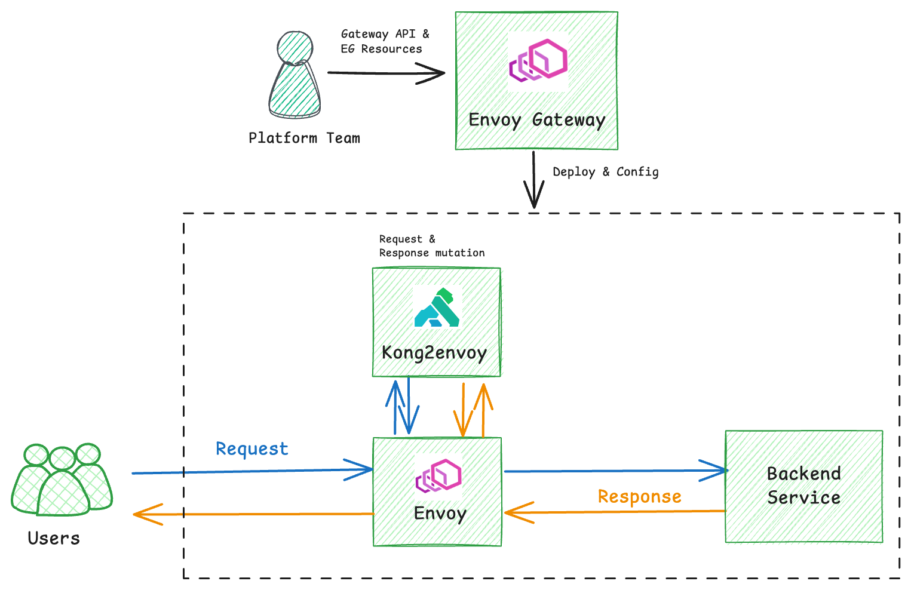

# kong2eg

`kong2eg` is a migration tool that helps you transition from Kong Gateway to Envoy Gateway by integrating Kong as an external processing extension within Envoy Gateway. This enables continued usage of Kong plugins for request and response transformation, while routing and traffic control are handled by Envoy Gateway.

This approach provides a smooth migration path for users relying on Kong's plugin ecosystem, particularly in cases where a full reimplementation with native Envoy Gateway features is not immediately feasible.

> Note: Most Kong plugins are supported, except those requiring a database.
# How it works

This diagram illustrates the interactions between Envoy Gateway, Envoy, `kong2envoy`, and Kong:



* `kong2eg` generates all the necessary resources to deploy Kong as an external processing extension for Envoy Gateway.
* Envoy Gateway deploys `kong2envoy` as a sidecar to Envoy Proxy and sets up an EnvoyExtensionPolicy to use it for request and response processing.
* `kong2envoy` is implemented as an [External Processing Extension](https://gateway.envoyproxy.io/docs/tasks/extensibility/ext-proc/)
that communicates with Envoy Proxy using gRPC over an Unix domain socket.
* Envoy Proxy forwards requests and responses to `kong2envoy` for processing before forwarding them to the backend or client.
* Inside `kong2envoy`, a Kong instance processes requests and responses using a ConfigMap-provided configuration.

The Kong configuration is stored in a ConfigMap, which is mounted into the `kong2envoy` container. `kong2envoy` reads the configuration from the ConfigMap and applies it to the Kong instance running inside the container.

All routing decisions are made by Envoy Gateway.
Kong is only responsible for modifying requests and responses (e.g., adding headers, modifying body, etc).

# Installation

Download the `kong2eg` binary from the [releases page](https://github.com/tetratelabs/kong2eg/releases) or install it using:

```bash
go install github.com/tetratelabs/kong2eg/cmd/kong2eg@latest
```

To build from source:

```bash
git clone https://github.com/tetratelabs/kong2eg.git
make build
```

# Migrating from Kong Gateway to Envoy Gateway

## Step 1: Install Envoy Gateway with Backend API enabled

The Backend API is an Envoy Gateway extension that allows integration with non-Kubernetes backends, including UDS-based services like `kong2envoy`.

```bash
helm install eg oci://docker.io/envoyproxy/gateway-helm \
  --version v1.4.1 \
  --set config.envoyGateway.extensionApis.enableBackend=true \
  -n envoy-gateway-system \
  --create-namespace
```

## Step 2: Deploy the Demo App

Deploy a demo app that relies on Kong plugins for traffic processing.

```bash
kubectl apply -f https://github.com/envoyproxy/gateway/releases/download/v1.4.1/quickstart.yaml
```

## Step 3: Deploy kong2envoy Using kong2eg CLI

Then we use the kong2eg CLI to generate the necessary resources to deploy kong2envoy as an external processing extension in Envoy Gateway.

```bash
kong2eg print | kubectl apply -f -
```

This command generates the below resources and applies them to the cluster:
* GatewayClass and Gateway resources to deploy Envoy Proxy.
* EnvoyProxy resource to deploy kong2envoy as a sidecar to Envoy Proxy.
* Backend resource to define the UDS socket that kong2envoy will use to communicate with Envoy Proxy.
* EnvoyExtensionPolicy resource to tell Envoy Proxy to use kong2envoy for request and response processing.
* A ConfigMap containing the demo Kong configuration, which adds request and response headers to the requests and responses.
* Role and RoleBinding to grant kong2envoy ConfigMap read permissions.

You can preview the YAML output by running:

```bash
kong2eg print
```

## Test the Setup

```bash
curl http://172.18.0.200 -H "Host: www.example.com"
```

You should see the request and response headers added by the configured Kong plugins.

```
< HTTP/1.1 200 OK
... (other headers)

# Response Headers added by Kong plugins
< x-kong-response-header-1: foo
< x-kong-response-header-2: bar

{
 "path": "/",
 "host": "www.example.com",
 "method": "GET",
 "proto": "HTTP/1.1",
 "headers": {

  # Request Headers added by Kong plugins
  "X-Kong-Request-Header-1": [
   "foo"
  ],
  "X-Kong-Request-Header-2": [
   "bar"
  ],
  "X-Kong-Request-Id": [
   "56ee67759d59160cd3fb1975f753843b"
  ],

 },

}
```

## Migrating Your Kong Gateway to Envoy Gateway

The demo gives us a basic understanding of how Kong2eg works. Then we can use it to migrate your existing Kong Gateway to Envoy Gateway.

Kong2eg accepts a few command line flags to customize the generated resources. You can run `kong2eg print -h` to see the available options.

```bash
kong2eg print -h
Prints Envoy Gateway configuration to run Kong plugins with kong2envoy

Usage:
  kong2eg print  [flags]

Aliases:
  print, p

Flags:
      --envoy-gateway-deploy-mode string   Envoy Gateway deployment mode. Options: ControllerNamespace, or GatewayNamespace. (default "ControllerNamespace")
      --gateway string                     Name of the Envoy Gateway resource. (default "eg")
      --gatewayclass string                Name of the GatewayClass resource. (default "eg")
  -h, --help                               help for print
      --kong-config string                 Kong configuration file to use. Defaults to the embedded demo configuration.
      --namespace string                   Kubernetes namespace to use for the Envoy Gateway resources. (default "default")
```

You can save the output to a file, review the generated resources, and make any necessary adjustments—for example, tuning resource requests and limits based on your application’s load—before applying them to the cluster.

```bash
kong2eg print --kong-config kong.yaml --namespace default --gateway eg --gatewayclass eg  > kong2eg.yaml
 ```

Here is a brief overview of the generated resources.

1. `EnvoyProxy` – Configures the Envoy Proxy deployment to include `kong2envoy` as a sidecar container. This resource ensures that the `kong2envoy` extension is injected into the Envoy pod for request and response processing.

```yaml
apiVersion: gateway.envoyproxy.io/v1alpha1
kind: EnvoyProxy
metadata:
  annotations:
    tetrate.io/generated-by: kong2eg
  name: kong2eg-proxy-config
  namespace: default
spec:
  logging:
    level:
      default: info
  provider:
    type: Kubernetes
    kubernetes:
      envoyDeployment:
        container:
          volumeMounts:
          - name: socket-dir
            mountPath: /var/sock/kong  # uds socket for envoy to connect to kong2envoy
        initContainers:
        - name: kong2envoy
          restartPolicy: Always
          image: tetrate/kong2envoy:v0.3.3
          readinessProbe:
            exec:
              command: ["kong", "health"]
            initialDelaySeconds: 5
          livenessProbe:
            exec:
              command: ["kong", "health"]
            initialDelaySeconds: 10
          ports:
          - containerPort: 6060 # pprof
          env:
          - name: CPU_REQUEST
            valueFrom:
              resourceFieldRef:
                containerName: kong2envoy
                resource: requests.cpu
          - name: NAMESPACE
            valueFrom:
              fieldRef:
                fieldPath: metadata.namespace
          - name: APP_LABEL
            valueFrom:
              fieldRef:
                fieldPath: metadata.labels['app']
          volumeMounts:
          - name: socket-dir
            mountPath: /var/sock/kong
          - name: kong-config
            mountPath: /usr/local/share/kong2envoy/
          - name: podinfo
            mountPath: /etc/podinfo
          resources:
            requests:
              cpu: 100m
              memory: 512Mi
          securityContext:
            runAsUser: 65532
            runAsGroup: 65532
            runAsNonRoot: true
        pod:
          labels:
            app: kong2envoy  # this label is used by kong2envoy to match the ConfigMap that contains the Kong configuration
          volumes:
            - name: podinfo
              downwardAPI:
                items:
                - path: "labels"
                  fieldRef:
                    fieldPath: metadata.labels
            - name: socket-dir
              emptyDir: {}
            - name: kong-config
              emptyDir: {}
```

1. `GatewayClass`– Specifies which controller—Envoy Gateway, in our case—manages the provisioning and lifecycle of Gateway resources.

```yaml
apiVersion: gateway.networking.k8s.io/v1
kind: GatewayClass
metadata:
  annotations:
    tetrate.io/generated-by: kong2eg
  name: eg
spec:
  controllerName: gateway.envoyproxy.io/gatewayclass-controller
```

1. `Gateway` Envoy Gateway watches this resource to provision the Envoy Proxy deployment. It references the EnvoyProxy via the infrastructure.parametersRef field to ensure the sidecar is included.

```yaml
apiVersion: gateway.networking.k8s.io/v1
kind: Gateway
metadata:
  annotations:
    tetrate.io/generated-by: kong2eg
  name: eg
  namespace: default
spec:
  gatewayClassName: eg
  infrastructure:
    parametersRef:
      group: gateway.envoyproxy.io
      kind: EnvoyProxy
      name: kong2eg-proxy-config
  listeners:
    - name: http
      protocol: HTTP
      port: 80
```

1. `Role` and `RoleBinding` – Grants kong2envoy the necessary permissions to read the ConfigMap containing its plugin configuration.

```yaml
# RoleBinding is created to grant kong2envoy ConfigMap read permissions.
# This is necessary for kong2envoy to load the Kong configuration from ConfigMaps.
apiVersion: rbac.authorization.k8s.io/v1
kind: RoleBinding
metadata:
  annotations:
    tetrate.io/generated-by: kong2eg
  name: envoy-default-eg-e41e7b31
  namespace: envoy-gateway-system
roleRef:
  apiGroup: rbac.authorization.k8s.io
  kind: Role
  name: envoy-default-eg-e41e7b31
subjects:
- kind: ServiceAccount
  name: envoy-default-eg-e41e7b31
  namespace: envoy-gateway-system
---
apiVersion: rbac.authorization.k8s.io/v1
kind: Role
metadata:
  annotations:
    tetrate.io/generated-by: kong2eg
  name: envoy-default-eg-e41e7b31
  namespace: envoy-gateway-system
rules:
- apiGroups:
  - ""
  resources:
  - configmaps
  verbs:
  - get
  - list
  - watch
```

1.  `Backend` – Describes the backend service (in this case, a Unix Domain Socket) that Envoy Proxy uses to communicate with kong2envoy.

```yaml
apiVersion: gateway.envoyproxy.io/v1alpha1
kind: Backend
metadata:
  annotations:
    tetrate.io/generated-by: kong2eg
  name: kong2envoy
  namespace: default
spec:
  endpoints:
  - unix:
      path: /var/sock/kong/ext-proc.sock
```

1.  `EnvoyExtensionPolicy` – Instructs Envoy Proxy to use kong2envoy as an external processing service for request and response transformation.

```yaml
apiVersion: gateway.envoyproxy.io/v1alpha1
kind: EnvoyExtensionPolicy
metadata:
  annotations:
    tetrate.io/generated-by: kong2eg
  name: kong2envoy
  namespace: default
spec:
  targetRefs:
    - group: gateway.networking.k8s.io
      kind: Gateway
      name: eg
  extProc:
  - backendRefs:
    - name: kong2envoy
      kind: Backend
      group: gateway.envoyproxy.io
    messageTimeout: 10s
    processingMode:
      request:
        body: Buffered
      response:
        body: Buffered
```

1. `ConfigMap` – Contains the Kong configuration used by kong2envoy. This is loaded from the `--kong-config`~ flag passed to kong2eg print. If not provided, a default demo configuration is used.

```yaml
apiVersion: v1
kind: ConfigMap
metadata:
  annotations:
    extension.tetrate.io/generator: kong2eg
    tetrate.io/generated-by: kong2eg
  name: kong-config
  namespace: "envoy-gateway-system"
  labels:
    extension.tetrate.io/kong-config: "true"
    app: kong2envoy
data:
  config: |+
    kong.yaml: |+
      _format_version: "3.0"
      _transform: true
      services:
      - name: receiver
        url: http://localhost:16002
        routes:
        - name: my-route-0
          hosts:
          - www.example.com:10080
          paths:
          - /
          plugins:
          - name: request-transformer
            config:
              add:
                headers:
                - "x-kong-request-header-1:foo"
                - "x-kong-request-header-2:bar"
          - name: response-transformer
            config:
              add:
                headers:
                - "x-kong-response-header-1:foo"
                - "x-kong-response-header-2:bar"
        - name: my-route-1
          hosts:
          - foo.bar.com:10080
          paths:
          - /
          plugins:
          - name: request-transformer
            config:
              add:
                headers:
                - "x-kong-request-header-3:foo"
                - "x-kong-request-header-4:bar"
          - name: response-transformer
            config:
              add:
                headers:
                - "x-kong-response-header-3:foo"
                - "x-kong-response-header-4:bar
```

Note:
* The service url must be set to `http://localhost:16002`, which is the internal address where kong2envoy receives mutated requests from Kong. If this is not correctly set, kong2envoy won’t be able to process the requests.
* The port in the hostnames defined in the Kong configuration (e.g., `www.example.com:10080`) must match the internal listener port used by Envoy. This is a known limitation due to how external processing (ext-proc) works in Envoy.
  * If the Gateway listener port is less than 1024, the Envoy listener port is calculated as 10000 + <Gateway port> (e.g., port 80 becomes 10080).
  * If the Gateway listener port is 1024 or higher, Envoy uses the same port number as specified in the Gateway.
* In this setup, Kong is responsible only for transforming requests and responses. Routing and traffic management are handled by Envoy Gateway.
This means the routes defined in your Kong configuration should align with the HTTPRoute resources in Envoy Gateway.
For example, the configuration above includes two routes — one for `www.example.com` and another for `foo.bar.com`. These should match the corresponding HTTPRoute definitions you’ll create in the next step.

Next, create `HTTPRoute` resources to define routing rules for your application and verify that the Kong plugins are functioning as expected. You can also use the `ingress2gateway` tool to migrate existing Ingress resources to HTTPRoute resources. However,
you may need to adjust the generated resources to work with Envoy Gateway, as described in the next section.

```yaml
apiVersion: gateway.networking.k8s.io/v1
kind: HTTPRoute
metadata:
  name: httproute
spec:
  hostnames:
  - www.example.com
  parentRefs:
  - group: gateway.networking.k8s.io
    kind: Gateway
    name: eg
  rules:
  - backendRefs:
    - group: ""
      kind: Service
      name: backend
      port: 3000
    matches:
    - path:
        type: PathPrefix
        value: /
---
apiVersion: gateway.networking.k8s.io/v1
kind: HTTPRoute
metadata:
  name: foo
spec:
  hostnames:
  - foo.bar.com
  parentRefs:
  - group: gateway.networking.k8s.io
    kind: Gateway
    name: eg
  rules:
  - backendRefs:
    - group: ""
      kind: Service
      name: backend
      port: 3000
    matches:
    - path:
        type: PathPrefix
        value: /
```

## Custom Kong Plugins

Kong2eg also supports custom Kong plugins. You can define your plugin in a ConfigMap and reference it directly in your Kong configuration.

For example, if you have a custom plugin called `my-custom-plugin` stored in a ConfigMap named `custom-kong-plugin`, you can include it in your Kong config like this:

```yaml
apiVersion: v1
kind: ConfigMap
metadata:
  labels:
    app: kong2envoy
    extension.tetrate.io/kong-config: "true"
  name: kong-config
  namespace: envoy-gateway-system
data:
  config: |
    plugins:
    - name: my-custom-plugin
      configMapName: custom-kong-plugin
    kong.yaml: |+
      _format_version: "3.0"
      _transform: true
      services:
      - name: receiver
        url: http://localhost:16002
        routes:
        - name: no-op-route # The fallback route for Kong to handle unmatched requests
          paths:
          - /
        - name: my-route-0
          hosts:
          - www.example.com:10080
          paths:
          - /
          plugins:
          - name: my-custom-plugin
            config:
              message: "Hello from my custom plugin!"
```

You can find a sample custom Kong plugin configuration in the `examples/custom-kong-plugin` directory. This example plugin adds a `x-my-custom-plugin-message` header to the response with a custom message.

Create the ConfigMap for the custom plugin, and include it in the Kong configuration:

```bash
kubectl apply -f examples/custom-kong-plugin
```

You 'll see the header added to the response when you make a request to the service:

```bash
curl http://172.18.0.200/ -H "Host: www.example.com"   -v

< HTTP/1.1 200 OK
... (other headers)

# Response Headers added by the custom Kong plugin
< x-my-custom-plugin-message: Hello from my custom plugin!

```

## Migrating Kubernetes Ingress to Gateway API

In the previous step, we use kong2envoy to migrate your existing Kong plugins to Envoy Gateway. kong2envoy handles request and response processing, while routing decisions are made by Envoy Gateway.

If you’re already using the Gateway API with Kong, you should be able to continue using the same Gateway API resources with Envoy Gateway—except for the Kong-specific HTTPRoute filters, which will need to be replaced with [Envoy Gateway HTTPRouteFilter or Envoy Gateway Policies](https://gateway.envoyproxy.io/docs/api/extension_types/).

If you’re currently using Ingress resources to route traffic to your application, you can migrate those to Gateway resources as part of the transition.

### Install Ingress2gateway command line tool

This tool can help you migrate Ingress resources to Gateway resources. It can be installed using the following command:

```bash
brew install ingress2gateway
```

Or

```bash
go install github.com/kubernetes-sigs/ingress2gateway@v0.4.0
```

### Convert Ingress resources to Gateway resources

ingress2gateway prints the Gateway resources to stdout. You can redirect the output to a file and apply it to the cluster.

ingress2gateway can directly read the Ingress and Kong resources from the cluster, for example:

```bash
ingress2gateway print \
  --providers=kong \
  -A
```

Or you can provide the Ingress and Kong resources as a file with the --input-file flag:

```bash
ingress2gateway print \
  --providers=kong \
  --input-file ingress2gateway/ingress-kong.yaml \
  -A
```

We use the sample Ingress and Kong resources in the ingress2gateway directory as the input file.

You'll see the output Gateway resources in the terminal.

```yaml
apiVersion: gateway.networking.k8s.io/v1
kind: Gateway
metadata:
  annotations:
    gateway.networking.k8s.io/generator: ingress2gateway-0.4.0
  creationTimestamp: null
  name: kong
spec:
  gatewayClassName: kong
  listeners:
  - name: http
    port: 80
    protocol: HTTP
---
apiVersion: gateway.networking.k8s.io/v1
kind: HTTPRoute
metadata:
  annotations:
    gateway.networking.k8s.io/generator: ingress2gateway-0.4.0
  creationTimestamp: null
  name: echo-ingress-all-hosts
spec:
  parentRefs:
  - name: kong
  rules:
  - backendRefs:
    - name: echo
      port: 1027
    filters:
    - extensionRef:
        group: configuration.konghq.com
        kind: KongPlugin
        name: key-auth-example
      type: ExtensionRef
    matches:
    - path:
        type: PathPrefix
        value: /echo
```

While most of the generated Gateway resources are correct, a few adjustments are needed to make them work with Envoy Gateway:
1. Skip the GatewayClass included in the output. Instead, use the one you created earlier that’s managed by Envoy Gateway.
2. Update the gatewayClassName field in the output Gateway resources to match the correct class name—for example, eg.
3. Reference the EnvoyProxy you created earlier in the infrastructure field of the Gateway resources, if you’re linking the EnvoyProxy to the Gateway directly (instead of to the GatewayClass).
4. Update the HTTPRoute resources to replace Kong plugins with either the [Envoy Gateway HTTPRouteFilter or Envoy Gateway Policies](https://gateway.envoyproxy.io/docs/api/extension_types/).

Here is the adjusted Gateway resources for the example output:

```yaml
apiVersion: gateway.networking.k8s.io/v1
kind: Gateway
metadata:
  annotations:
    gateway.networking.k8s.io/generator: ingress2gateway-0.4.0
  name: eg
spec:
  gatewayClassName: eg
  infrastructure:
    parametersRef:
      group: gateway.envoyproxy.io
      kind: EnvoyProxy
      name: kong2eg-proxy-config
  listeners:
    - name: http
      protocol: HTTP
      port: 80
---
apiVersion: gateway.networking.k8s.io/v1
kind: HTTPRoute
metadata:
  annotations:
    gateway.networking.k8s.io/generator: ingress2gateway-0.4.0
  name: echo-ingress-all-hosts
spec:
  parentRefs:
  - name: eg
  rules:
  - backendRefs:
    - name: echo
      port: 1027
    matches:
    - path:
        type: PathPrefix
        value: /echo
---
# We use Envoy Gateway SecurityPolicy to replace the Kong key-auth plugin.
---
apiVersion: gateway.envoyproxy.io/v1alpha1
kind: SecurityPolicy
metadata:
  name: apikey-auth
spec:
  targetRefs:
    - group: gateway.networking.k8s.io
      kind: HTTPRoute
      name: echo-ingress-all-hosts
  apiKeyAuth:
    credentialRefs:
    - group: ""
      kind: Secret
      name: apikey-secret
    extractFrom:
    - headers:
      - apikey
```


# What's Next

Once you’ve migrated from Kong to Envoy Gateway, you can gradually replace your existing Kong plugins with Gateway API [HTTPRoute filters](https://gateway-api.sigs.k8s.io/reference/spec/#gateway.networking.k8s.io/v1.HTTPRouteFilter) and [Envoy Gateway API Extensions](https://gateway.envoyproxy.io/docs/api/extension_types/).

This also gives you the opportunity to take advantage of Envoy Gateway’s advanced features for [traffic management](https://gateway.envoyproxy.io/docs/tasks/traffic/), [security](https://gateway.envoyproxy.io/docs/tasks/security/), [observability](https://gateway.envoyproxy.io/docs/tasks/observability/), and more.
