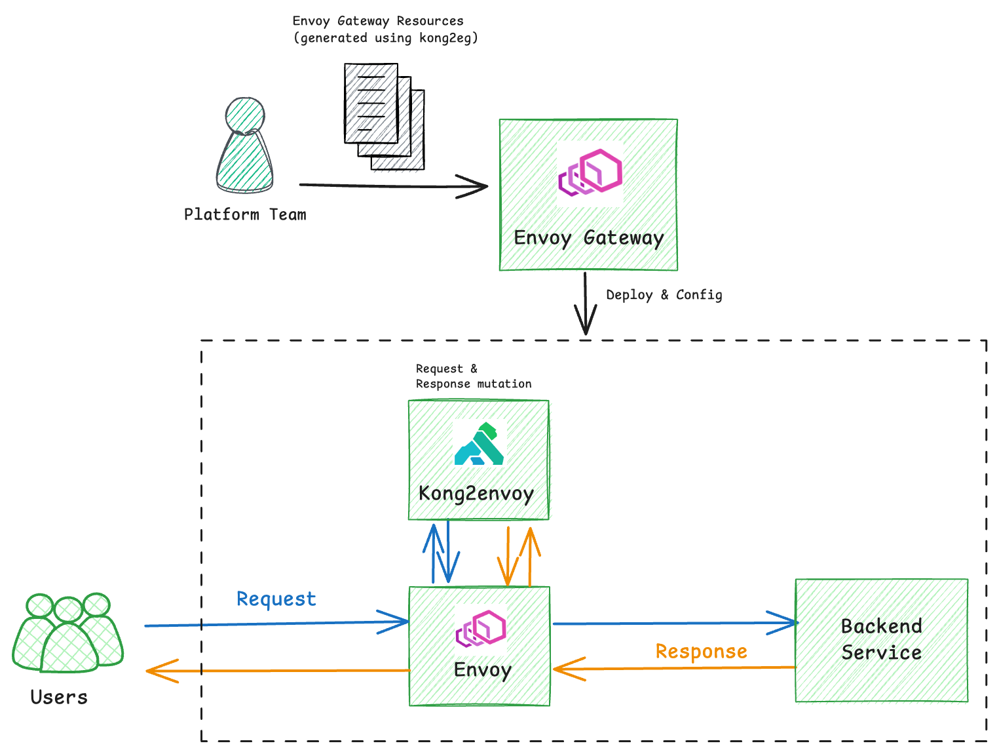

# Kong2eg

This repository demonstrates how to use kong2envoy and ingress2gateway to migrate from Kong to Envoy Gateway.
Most existing Kong plugins can still be used after the migration—except those that require a database.
Ingress API resources will be automatically converted to Gateway API resources.

# How it works

This diagram shows how Envoy Gateway, Envoy, Kong2envoy,and Kong work together:



* Envoy Gateway deploys kong2envoy as a sidecar to Envoy Proxy and sets up an EnvoyExtensionPolicy to use it for request and response processing.
* Kong2envoy is implemented as an [External Processing Extension](https://gateway.envoyproxy.io/docs/tasks/extensibility/ext-proc/)
that communicates with Envoy Proxy using gRPC over an Unix domain socket.
* Envoy Proxy forwards requests and responses to Kong2envoy for processing before forwarding them to the backend or client.
* Kong2envoy runs a Kong instance in its own container and forwards requests and responses to Kong for processing.

You define the Kong configuration in a ConfigMap labeled:

```yaml
extension.tetrate.io/kong-config: "true"
app: kong2envoy
```

All routing decisions are made by Envoy Gateway.
Kong is only responsible for modifying requests and responses (e.g., adding headers, modifying body, etc).

# Demo

This repository contains a quickstart demo that you can use to test kong2envoy.

## Install Envoy Gateway with Backend resource enabled:

```bash
helm install eg oci://docker.io/envoyproxy/gateway-helm \
  --version v1.4.0 \
  --set config.envoyGateway.extensionApis.enableBackend=true \
  -n envoy-gateway-system \
  --create-namespace
```

## Deploy the demo app

Deploy the demo app from the Envoy Gateway quickstart.

```bash
kubectl apply -f https://github.com/envoyproxy/gateway/releases/download/v1.4.0/quickstart.yaml
```

## Install kong2envoy

This step deploys kong2envoy as a sidecar to Envoy Proxy and sets up an EnvoyExtensionPolicy to use it for request and response processing.

It also creates a Role and RoleBinding to grant kong2envoy ConfigMap read permissions. This is necessary for kong2envoy to load the Kong configuration from configMaps.

```bash
kubectl apply -f kong2envoy
```

## Test the Setup

```bash
curl http://172.18.0.200 -H "Host: www.example.com"
```

You should see response headers added by Kong:
```
"Via": [
   "1.1 kong/3.9.0"
  ],
  "X-Kong-Proxy-Latency": [
   "1"
  ],
  "X-Kong-Request-Id": [
   "f5fe5d3dfcf3a06452b66b33c2fa1c1b"
  ],
  "X-Kong-Response-Header-1": [
   "foo"
  ],
  "X-Kong-Response-Header-2": [
   "bar"
  ],
  "X-Kong-Upstream-Latency": [
   "8"
  ]
```

# Migrate Your Kong Gateway to Envoy Gateway

## Kong Plugins Migration

As the demo shows, the Kong2Envoy lets you continue using your existing Kong plugins for request and response processing, even after migrating from Ingress to Gateway, enabling a smoother transition. You can then gradually replace those plugins with Gateway API [HTTPRoute filters](https://gateway-api.sigs.k8s.io/reference/spec/#gateway.networking.k8s.io/v1.HTTPRouteFilter) and [Envoy Gateway API Extensions](https://gateway.envoyproxy.io/docs/api/extension_types/) at your own pace.

You can use the sample configuration in the kong2envoy directory as a reference for migrating your Kong plugins to Envoy Gateway.

1. Create a `EnvoyProxy` resource to deploy kong2envoy as a sidecar to Envoy Proxy.

```yaml
apiVersion: gateway.envoyproxy.io/v1alpha1
kind: EnvoyProxy
metadata:
  name: custom-proxy-config
spec:
  logging:
    level:
      default: info
  provider:
    type: Kubernetes
    kubernetes:
      envoyDeployment:
        container:
          volumeMounts:
          - name: socket-dir
            mountPath: /var/sock/kong  # uds socket for envoy to connect to kong2envoy
        initContainers:
        - name: ext-proc
          restartPolicy: Always
          image: zhaohuabing/kong2envoy:latest
          readinessProbe:
            exec:
              command: ["kong", "health"]
            initialDelaySeconds: 5
          livenessProbe:
            exec:
              command: ["kong", "health"]
            initialDelaySeconds: 10
          ports:
          - containerPort: 6060 # pprof
          env:
          - name: CPU_REQUEST
            valueFrom:
              resourceFieldRef:
                containerName: ext-proc
                resource: requests.cpu
          - name: NAMESPACE
            valueFrom:
              fieldRef:
                fieldPath: metadata.namespace
          - name: DEBUG
            value: "true"
          - name: APP_LABEL
            valueFrom:
              fieldRef:
                fieldPath: metadata.labels['app']
          volumeMounts:
          - name: socket-dir
            mountPath: /var/sock/kong
          - name: kong-config
            mountPath: /usr/local/share/kong2envoy/
          - name: podinfo
            mountPath: /etc/podinfo
          resources:
            limits:
              cpu: "6"
              memory: "2Gi"
            requests:
              cpu: "6"
              memory: "2Gi"
          securityContext:
            runAsUser: 65532
            runAsGroup: 65532
            runAsNonRoot: true
        pod:
          labels:
            app: kong2envoy  # this label is used by kong2envoy to match the ConfigMap that contains the Kong configuration
          volumes:
            - name: podinfo
              downwardAPI:
                items:
                - path: "labels"
                  fieldRef:
                    fieldPath: metadata.labels
            - name: socket-dir
              emptyDir: {}
            - name: kong-config
              emptyDir: {}
```

1. Create a `GatewayClass` resource. GatewayClass is used to define the controller that will be used to manage the Gateway resource.

```yaml
apiVersion: gateway.networking.k8s.io/v1
kind: GatewayClass
metadata:
  name: eg
spec:
  controllerName: gateway.envoyproxy.io/gatewayclass-controller
```

1. Create a `Gateway` resource. Envoy Gateway will watch the Gateway resource and deploy Envoy Proxy for it. Reference the `EnvoyProxy` resource that you created in step 1 in the `infrastructure` field.

Note: `EnvoyProxy` resource can also be [associated with a `GatewayClass` to apply it to all `Gateway` resources of that `GatewayClass`](https://gateway.envoyproxy.io/docs/tasks/operations/customize-envoyproxy/).

```yaml
apiVersion: gateway.networking.k8s.io/v1
kind: Gateway
metadata:
  name: eg
spec:
  gatewayClassName: eg
  infrastructure:
    parametersRef:
      group: gateway.envoyproxy.io
      kind: EnvoyProxy
      name: custom-proxy-config
  listeners:
    - name: http
      protocol: HTTP
      port: 80
```

1. Create a `Role` and `RoleBinding` to grant kong2envoy ConfigMap read permissions. Please change the name of the Role and RoleBinding to match your Envoy service account name.

The Envoy service account name is the same as the Envoy deployment name. It's usually in the format of `envoy-default-eg-xxxxxxxx`.

You can find the Envoy service account name by running the following command:

```bash
kubectl get sa -n envoy-gateway-system --selector=gateway.envoyproxy.io/owning-gateway-name=${GATEWAY_NAME}
```

`${GATEWAY_NAME}` is the name of the Gateway resource that you created in step 1.

For example:

```bash
kubectl get sa -n envoy-gateway-system --selector=gateway.envoyproxy.io/owning-gateway-name=eg
NAME                        SECRETS   AGE
envoy-default-eg-e41e7b31   0         14m
```

```yaml
# RoleBinding is created to grant kong2envoy ConfigMap read permissions.
# This is necessary for kong2envoy to load the Kong configuration from ConfigMaps.
apiVersion: rbac.authorization.k8s.io/v1
kind: RoleBinding
metadata:
  name: envoy-default-eg-e41e7b31  # change this name to match your Envoy service account name
  namespace: envoy-gateway-system
roleRef:
  apiGroup: rbac.authorization.k8s.io
  kind: Role
  name: envoy-default-eg-e41e7b31 # change this name to match your Envoy service account name
subjects:
- kind: ServiceAccount
  name: envoy-default-eg-e41e7b31
  namespace: envoy-gateway-system
---
apiVersion: rbac.authorization.k8s.io/v1
kind: Role
metadata:
  name: envoy-default-eg-e41e7b31 # change this name to match your Envoy service account name
  namespace: envoy-gateway-system
rules:
- apiGroups:
  - ""
  resources:
  - configmaps
  verbs:
  - get
  - list
  - watch
```

1. Create one or more `HTTPRoute` resources to define the routing rules for your application.

```yaml
apiVersion: gateway.networking.k8s.io/v1
kind: HTTPRoute
metadata:
  name: httproute
spec:
  hostnames:
  - www.example.com
  parentRefs:
  - group: gateway.networking.k8s.io
    kind: Gateway
    name: eg
  rules:
  - backendRefs:
    - group: ""
      kind: Service
      name: backend
      port: 3000
      weight: 1
    matches:
    - path:
        type: PathPrefix
        value: /
```

1. Create a `Backend` resource to define the backend service that will be used by Envoy Proxy to connect to kong2envoy.

```yaml
apiVersion: gateway.envoyproxy.io/v1alpha1
kind: Backend
metadata:
  name: kong2envoy
spec:
  endpoints:
  - unix:
      path: /var/sock/kong/ext-proc.sock
```

1. Create an `EnvoyExtensionPolicy` resource to tell Envoy Proxy to use kong2envoy as an external processing extension.

```yaml
apiVersion: gateway.envoyproxy.io/v1alpha1
kind: EnvoyExtensionPolicy
metadata:
  name: kong2envoy
spec:
  targetRefs:
    - group: gateway.networking.k8s.io
      kind: Gateway
      name: eg
  extProc:
  - backendRefs:
    - name: kong2envoy
      kind: Backend
      group: gateway.envoyproxy.io
    processingMode:
      request: {}
      response: {}
```

1. Configure the Kong configuration in a ConfigMap. You can migrate your existing Kong configuration to the ConfigMap.

```yaml
apiVersion: v1
kind: ConfigMap
metadata:
  name: kong-config
  namespace: envoy-gateway-system
  labels:
    extension.tetrate.io/kong-config: "true"
    app: kong2envoy
data:
  config: |+
    kong.yaml: |+
      _format_version: "3.0"
      _transform: true
      services:
      - name: example
        url: http://www.example.com
        routes:
        - name: my-route-0
          paths:
          - /
          plugins:
          - name: request-transformer
            config:
              add:
                headers:
                - "x-kong-request-header-1:foo"
                - "x-kong-request-header-2:bar"
          - name: response-transformer
            config:
              add:
                headers:
                - "x-kong-response-header-1:foo"
                - "x-kong-response-header-2:bar"

```


## Ingress to Gateway API Migration

In the first step, we use Kong2Envoy to migrate your existing Kong plugins to Envoy Gateway. Kong2Envoy handles request and response processing, while routing decisions are made by Envoy Gateway.

If you’re already using the Gateway API with Kong, you should be able to continue using the same Gateway API resources with Envoy Gateway—except for the Kong-specific HTTPRoute filters, which will need to be replaced with [Envoy Gateway HTTPRouteFilter or Envoy Gateway Policies](https://gateway.envoyproxy.io/docs/api/extension_types/).

If you’re currently using Ingress resources to route traffic to your application, you can migrate those to Gateway resources as part of the transition.

## Install Ingress2gateway command line tool

This tool can help you migrate Ingress resources to Gateway resources. It can be installed using the following command:

```bash
brew install ingress2gateway
```

Or

```bash
go install github.com/kubernetes-sigs/ingress2gateway@v0.4.0
```

## Migrate Ingress resources to Gateway resources

ingress2gateway prints the Gateway resources to stdout. You can redirect the output to a file and apply it to the cluster.

ingress2gateway can directly read the Ingress and kong resources from the cluster, for example:

```bash
ingress2gateway print \
  --providers=kong \
  -A
```

Or you can provide the Ingress and kong resources as a file with the --input-file flag:

```bash
ingress2gateway print \
  --providers=kong \
  --input-file ingress2gateway/ingress-kong.yaml \
  -A
```

We use the sample Ingress and kong resources in the ingress2gateway directory as the input file.

You'll see the output Gateway resources in the terminal.

```yaml
apiVersion: gateway.networking.k8s.io/v1
kind: Gateway
metadata:
  annotations:
    gateway.networking.k8s.io/generator: ingress2gateway-0.4.0
  creationTimestamp: null
  name: kong
spec:
  gatewayClassName: kong
  listeners:
  - name: http
    port: 80
    protocol: HTTP
---
apiVersion: gateway.networking.k8s.io/v1
kind: HTTPRoute
metadata:
  annotations:
    gateway.networking.k8s.io/generator: ingress2gateway-0.4.0
  creationTimestamp: null
  name: echo-ingress-all-hosts
spec:
  parentRefs:
  - name: kong
  rules:
  - backendRefs:
    - name: echo
      port: 1027
    filters:
    - extensionRef:
        group: configuration.konghq.com
        kind: KongPlugin
        name: key-auth-example
      type: ExtensionRef
    matches:
    - path:
        type: PathPrefix
        value: /echo
```

While most of the generated Gateway resources are correct, a few adjustments are needed to make them work with Envoy Gateway:
1. Skip the GatewayClass included in the output. Instead, use the one you created earlier that’s managed by Envoy Gateway.
2. Update the gatewayClassName field in the output Gateway resources to match the correct class name—for example, eg.
3. Reference the EnvoyProxy you created earlier in the infrastructure field of the Gateway resources, if you’re linking the EnvoyProxy to the Gateway directly (instead of to the GatewayClass).
4. Update the HTTPRoute resources to replace Kong plugins with either [Envoy Gateway HTTPRouteFilters or Envoy Gateway Policies](https://gateway.envoyproxy.io/docs/api/extension_types/).

Here is the adjusted Gateway resources for the example output:

```yaml
apiVersion: gateway.networking.k8s.io/v1
kind: Gateway
metadata:
  annotations:
    gateway.networking.k8s.io/generator: ingress2gateway-0.4.0
  name: eg
spec:
  gatewayClassName: eg
  infrastructure:
    parametersRef:
      group: gateway.envoyproxy.io
      kind: EnvoyProxy
      name: custom-proxy-config
  listeners:
    - name: http
      protocol: HTTP
      port: 80
---
apiVersion: gateway.networking.k8s.io/v1
kind: HTTPRoute
metadata:
  annotations:
    gateway.networking.k8s.io/generator: ingress2gateway-0.4.0
  name: echo-ingress-all-hosts
spec:
  parentRefs:
  - name: eg
  rules:
  - backendRefs:
    - name: echo
      port: 1027
    matches:
    - path:
        type: PathPrefix
        value: /echo
---
# We use Envoy Gateway SecurityPolicy to replace the Kong key-auth plugin.
---
apiVersion: gateway.envoyproxy.io/v1alpha1
kind: SecurityPolicy
metadata:
  name: apikey-auth
spec:
  targetRefs:
    - group: gateway.networking.k8s.io
      kind: HTTPRoute
      name: echo-ingress-all-hosts
  apiKeyAuth:
    credentialRefs:
    - group: ""
      kind: Secret
      name: apikey-secret
    extractFrom:
    - headers:
      - apikey
```

# What's Next

Once you’ve migrated your Ingress resources to Gateway resources, you can gradually replace your existing plugins with Gateway API [HTTPRoute filters](https://gateway-api.sigs.k8s.io/reference/spec/#gateway.networking.k8s.io/v1.HTTPRouteFilter) and [Envoy Gateway API Extensions](https://gateway.envoyproxy.io/docs/api/extension_types/).

This also gives you the opportunity to take advantage of Envoy Gateway’s advanced features for [traffic management](https://gateway.envoyproxy.io/docs/tasks/traffic/), [security](https://gateway.envoyproxy.io/docs/tasks/security/), [observability](https://gateway.envoyproxy.io/docs/tasks/observability/), and more.
